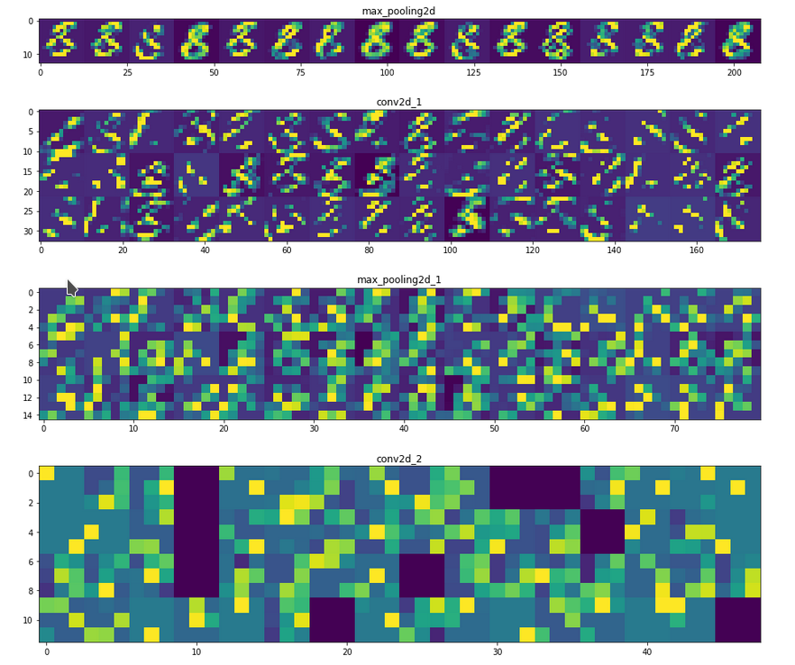

# Project: Image Recognition

### Description:
Starting from the MNIST dataset this project applies image recognition using convolutional neural networks (CNNs) implemented with Tensorflow and Keras.

### Tools:
* Tensorflow
* Keras

### Datasets:
* [MNIST](https://en.wikipedia.org/wiki/MNIST_database)
* [MNIST Fashion](https://github.com/zalandoresearch/fashion-mnist)
* [CIFAR-100](https://www.cs.toronto.edu/~kriz/cifar.html)
