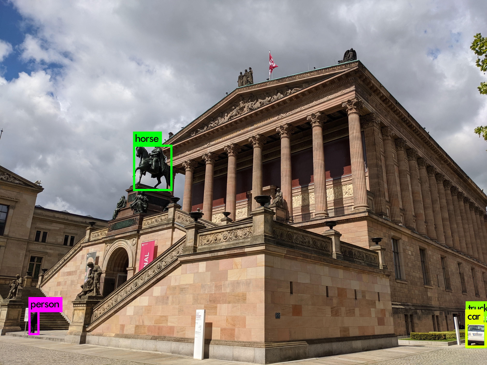

### Description:
The [YOLOv3 model](https://pjreddie.com/darknet/yolo/) allows to detect objects on images.
The here provided bash script and python files can be put into the darknet directory used to create a gif out of the YOLO predictions for a short .mp4 video.
After the installation of YOLOv3 insert the files into your darknet directory together with your video file. Then run bash yolo_gif.sh. 
